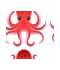

# Twin + Jest + React Testing Library + TypeScript

This repo shows a minimal example of how to test a Next.js app with Jest and React Testing Library.

This setup can also be used outside Next.js - just remove the next-specific parts from the config.

By default, `nextJest` will use the `swc` jest transformer, but here we override this with `babel-jest`.

## Key files

- `jest.config.js` The main config - you'll see options for both `styled-components` and `emotion`.
- `components/Test.test.tsx` A test example.

## Getting started

1. Install packages: `npm install`
2. Run tests: `npm test`
