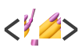
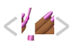

# Twin + Next.js + Styled Components + TypeScript

<p><a href="https://github.com/ben-rogerson/twin.macro#gh-light-mode-only" target="_blank"></a><a href="https://github.com/ben-rogerson/twin.macro#gh-dark-mode-only" target="_blank"></a><a href="https://nextjs.org#gh-light-mode-only" target="_blank"></a><a href="https://nextjs.org#gh-dark-mode-only" target="_blank"></a><a href="https://styled-components.com#gh-light-mode-only" target="_blank"></a><a href="https://styled-components.com#gh-dark-mode-only" target="_blank"></a><a href="https://www.typescriptlang.org/" target="_blank"></a>
</p>

**Download this example using [degit](https://github.com/Rich-Harris/degit)**

```shell
npx degit https://github.com/ben-rogerson/twin.examples/next-styled-components-typescript folder-name
```

From within the new folder, run `npm install`, then `npm run dev` to start the dev server.

[](#table-of-contents)

## Table of contents

- [Getting started](#getting-started)
  - [Installation](#installation)
  - [Add the global styles](#add-the-global-styles)
  - [Add the twin config](#add-the-twin-config)
  - [Add the TypeScript types](#add-typescript-types)
  - [Add the next babel config](#add-the-next-babel-config)
  - [Add the server stylesheet](#add-the-server-stylesheet)
- [Customization](#customization)
- [Next steps](#next-steps)

[](#getting-started)

## Getting started

### Installation

Install Next.js

```shell
npx create-next-app --ts
```

Install the dependencies

```shell
npm install styled-components
npm install -D twin.macro tailwindcss babel-plugin-macros @types/styled-components babel-loader @babel/plugin-syntax-typescript
```

<details>
  <summary>Install with Yarn</summary>

```shell
yarn create next-app --typescript
```

Install the dependencies

```shell
yarn add styled-components
yarn add twin.macro tailwindcss babel-plugin-macros @types/styled-components babel-loader @babel/plugin-syntax-typescript --dev
```

</details>

### Add the global styles

Twin uses the same [preflight base styles](https://unpkg.com/tailwindcss/dist/base.css) as Tailwind to smooth over cross-browser inconsistencies.

The `GlobalStyles` import adds these base styles along with some @keyframes for the animation classes and some global css that makes the [ring classes](https://tailwindcss.com/docs/ring-width) and box-shadows work.

> Due to an issue in styled-components, global styles get added in the wrong order when using styled-components. This gives the tailwind base styles an incorrect specificity.  
> Until [the issue](https://github.com/styled-components/styled-components/issues/3146) is fixed, the workaround is to export the styles from another file.

You can import `GlobalStyles` within a new file placed in `styles/GlobalStyles.tsx`:

```js
// styles/GlobalStyles.tsx
import React from 'react'
import { createGlobalStyle } from 'styled-components'
import tw, { theme, GlobalStyles as BaseStyles } from 'twin.macro'

const CustomStyles = createGlobalStyle({
  body: {
    WebkitTapHighlightColor: theme`colors.purple.500`,
    ...tw`antialiased`,
  },
})

const GlobalStyles = () => (
  <>
    <BaseStyles />
    <CustomStyles />
  </>
)

export default GlobalStyles
```

Then import the GlobalStyles file in `pages/_app.tsx`:

```js
// pages/_app.tsx
import type { AppProps } from 'next/app'
import GlobalStyles from '../styles/GlobalStyles'

function MyApp({ Component, pageProps }: AppProps) {
  return (
    <>
      <GlobalStyles />
      <Component {...pageProps} />
    </>
  )
}

export default MyApp
```

### Add the twin config

Twin’s config can be added in a couple of different files.

a) Either in `babel-plugin-macros.config.js`:

```js
// babel-plugin-macros.config.js
module.exports = {
  twin: {
    preset: 'styled-components',
  },
}
```

b) Or in `package.json`:

```js
// package.json
"babelMacros": {
  "twin": {
    "preset": "styled-components"
  }
},
```

### Add TypeScript types

Install the types for styled-components:

```bash
yarn add @types/styled-components -D
```

or npm:

```bash
npm install --save-dev @types/styled-components
```

Create a `types/twin.d.ts` file and add these declarations:

```typescript
// types/twin.d.ts
import 'twin.macro'
import styledImport, { CSSProp, css as cssImport } from 'styled-components'

declare module 'twin.macro' {
  // The styled and css imports
  const styled: typeof styledImport
  const css: typeof cssImport
}

declare module 'react' {
  // The css prop
  interface HTMLAttributes<T> extends DOMAttributes<T> {
    css?: CSSProp
    tw?: string
  }
  // The inline svg css prop
  interface SVGProps<T> extends SVGProps<SVGSVGElement> {
    css?: CSSProp
    tw?: string
  }
}

// The 'as' prop on styled components
declare global {
  namespace JSX {
    interface IntrinsicAttributes<T> extends DOMAttributes<T> {
      as?: string | Element
    }
  }
}
```

### Add the next babel config

Create a new file either in the root or in a `config`
subfolder:

```js
// withTwin.js
const path = require('path')

// The folders containing files importing twin.macro
const includedDirs = [
  path.resolve(__dirname, 'components'),
  path.resolve(__dirname, 'pages'),
  path.resolve(__dirname, 'styles'),
]

module.exports = function withTwin(nextConfig) {
  return {
    ...nextConfig,
    webpack(config, options) {
      const { dev, isServer } = options
      config.module = config.module || {}
      config.module.rules = config.module.rules || []
      config.module.rules.push({
        test: /\.(tsx|ts)$/,
        include: includedDirs,
        use: [
          options.defaultLoaders.babel,
          {
            loader: 'babel-loader',
            options: {
              sourceMaps: dev,
              plugins: [
                require.resolve('babel-plugin-macros'),
                [
                  require.resolve('babel-plugin-styled-components'),
                  { ssr: true, displayName: true },
                ],
                [
                  require.resolve('@babel/plugin-syntax-typescript'),
                  { isTSX: true },
                ],
              ],
            },
          },
        ],
      })

      if (!isServer) {
        config.resolve.fallback = {
          ...(config.resolve.fallback || {}),
          fs: false,
          module: false,
          path: false,
          os: false,
          crypto: false,
        }
      }

      if (typeof nextConfig.webpack === 'function') {
        return nextConfig.webpack(config, options)
      } else {
        return config
      }
    },
  }
}
```

Then in your `next.config.js`, import and wrap the main export with `withTwin(...)`:

```js
// next.config.js
const withTwin = require('./withTwin.js')

/**
 * @type {import('next').NextConfig}
 */
module.exports = withTwin({
  reactStrictMode: true, // < Recommended by Next
  // ...
})
```

### Add the server stylesheet

To avoid the ugly Flash Of Unstyled Content (FOUC), add a server stylesheet in `pages/_document.tsx` that gets read by Next.js:

```js
// pages/_document.tsx
import React from 'react'
import Document, { DocumentContext } from 'next/document'
import { ServerStyleSheet } from 'styled-components'

export default class MyDocument extends Document {
  static async getInitialProps(ctx: DocumentContext) {
    const sheet = new ServerStyleSheet()
    const originalRenderPage = ctx.renderPage
    try {
      ctx.renderPage = () =>
        originalRenderPage({
          enhanceApp: App => props => sheet.collectStyles(<App {...props} />),
        })
      const initialProps = await Document.getInitialProps(ctx)

      return {
        ...initialProps,
        styles: [
          <React.Fragment key="styles">
            {initialProps.styles}
            {sheet.getStyleElement()}
          </React.Fragment>,
        ],
      }
    } finally {
      sheet.seal()
    }
  }
}
```

[](#customization)

## Customization

- [View the config options →](https://github.com/ben-rogerson/twin.macro/blob/master/docs/options.md)
- [Customizing the tailwind config →](https://github.com/ben-rogerson/twin.macro/blob/master/docs/customizing-config.md)

[](#next-steps)

## Next steps

Learn how to work with twin

- [The prop styling guide](https://github.com/ben-rogerson/twin.macro/blob/master/docs/prop-styling-guide.md) - A must-read guide to level up on prop styling
- [The styled component guide](https://github.com/ben-rogerson/twin.macro/blob/master/docs/styled-component-guide.md) - A must-read guide on getting productive with styled-components

Learn more about styled-components

- [The css prop](https://styled-components.com/docs/api#css-prop)
- [The css import](https://styled-components.com/docs/api#css)
- [The styled import](https://styled-components.com/docs/api#styled)
